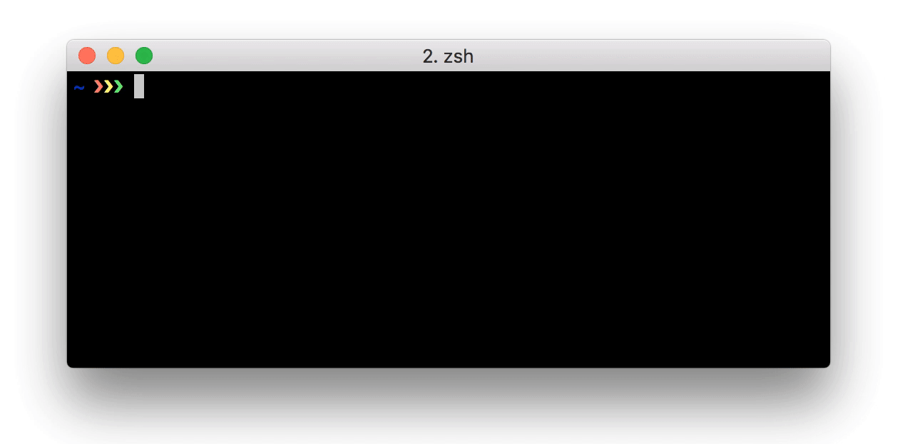

# 

[![Build Status][travis-image]][travis-url]
[![Dependency status][david-dm-image]][david-dm-url]

[travis-url]: https://travis-ci.org/danistefanovic/hooka
[travis-image]: http://img.shields.io/travis/danistefanovic/hooka.svg
[david-dm-url]:https://david-dm.org/danistefanovic/hooka
[david-dm-image]:https://david-dm.org/danistefanovic/hooka.svg

**Hooka** is a webhook server written in Node, which allows you to easily create HTTP endpoints to trigger the execution of configured commands.

## Installation

```
$ npm install -g hooka
```

## Features

* Zero coding
* Pass request data to the command
* Set validation rules to trigger hooks only under certain circumstances
* TLS/SSL support

## Documentation

* [CLI options](docs/cli.md)
* [Webhooks JSON](docs/webhooks.md)
* [Recipes](docs/recipes.md)
  * [Bitbucket](docs/recipes/bitbucket.md)
  * [GitHub](docs/recipes/github.md)
  * [Slack](docs/recipes/slack.md)

## Basic usage

1. Create a `webhooks.json` file:

  ```json
  [
      {
          "method": ["GET", "POST"],
          "path": "/hello",
          "command": "echo Hello world"
      },
      {
          "method": "POST",
          "path": "/hello-again",
          "command": "echo Hello from the other side: $MESSAGE",
          "validate": [
              {
                  "source": "jsonBody",
                  "find": "payload.token",
                  "match": "exactly",
                  "value": "MySecret"
              }
          ],
          "parseJson": [
              {
                  "query": "payload.hello",
                  "variable": "MESSAGE"
              }
          ]
      }
  ]
  ```

1. Start Hooka in the same directory:
  ```sh
  $ hooka
  ```

1. Open [http://localhost:3000/hello](http://localhost:3000/hello) in your browser to trigger the first hook.

1. Trigger the second hook with a POST request in a new terminal window:
  ```sh
  $ curl \
      -H "Content-Type: application/json" \
      -X POST \
      -d '{"hello": "I love cupcakes", "token": "MySecret"}' \
      http://localhost:3000/hello-again
  ```

1. Now if you go back to your terminal where Hooka is running, you should see something like:

<p align="center">
    
</p>

## Security

Since anyone could in principle send requests to your webhook server, it’s important to implement some basic security steps to keep your webhooks safe. Here are some tips that can help reduce the risks:

* Enable [TLS/SSL](docs/cli.md#--tlc-cert----tls-key) if the transmitted data is sensitive or if you wish to protect against replay attacks
* Use [validation rules](docs/webhooks.md#validate) to verify that the requests originated from the expected source. For example:
  * Enable HMAC based validation with the `hmac-sha1` match type
  * Send a custom token in the payload or as a HTTP header which has to match `exactly`
* [Obscurity](https://danielmiessler.com/study/security-by-obscurity/) *as a security layer*:
  * Set hook paths which are not easy to guess
  * Be creative with the HTTP method for the webhook

## License

> Do whatever you want with it, but don't blame me for anything that goes wrong.

MIT © [Daniel Stefanovic](http://twitter.com/danistefanovic)


